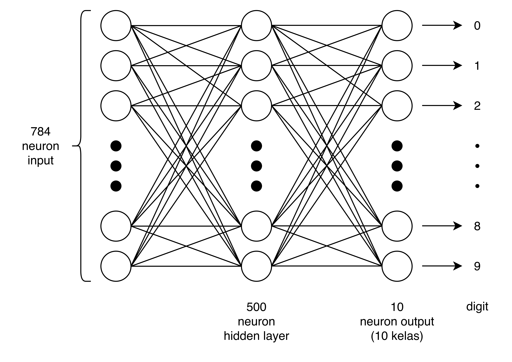
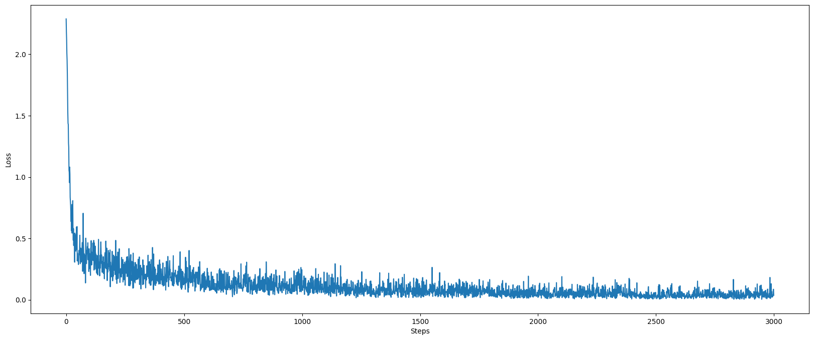

<table border style="width: 100%">
	<tr>
		<td><b>Nama</b></td>
		<td>Hugo Alfedo Putra</td>
		<td><b>NIM</b></td>
		<td>225150201111013</td>
	</tr>
	<tr>
		<td><b>Kelas</b></td>
		<td>DL-B</td>
		<td><b>Tanggal Tugas</b></td>
		<td>3 September 2024</td>
	</tr>
	<tr>
		<td colspan=2><b>Judul Tugas</b></td>
		<td colspan=2>Backpropagation Menggunakan PyTorch</td>
	</tr>
</table>

<br>

Laporan ini ditulis sesuai dengan urutan kemunculan cuplikan-cuplikan kode pada [contoh feed-forward neural-network PyTorch oleh junjey](https://github.com/yunjey/pytorch-tutorial/blob/master/tutorials/01-basics/feedforward_neural_network/main.py).

# Pengaturan Hyper-parameter

```py
# Hyper-parameters
input_size = 784; hidden_size = 500; num_classes = 10; num_epochs = 5; batch_size = 100; learning_rate = 0.001
```

Cuplikan di atas menunjukkan enam hyper-parameter yang digunakan, yaitu:

1. `input_size`: banyak neuron input pada jaringan. Perlu diketahui, berdasarkan LeCun pada [situs ini](https://yann.lecun.com/exdb/mnist/):

```
.... the images were centered in a 28x28 image by computing the center of mass of the pixels, ...
```

bahwa gambar-gambar pada dataset MNIST memiliki ukuran 28 pixel kali 28 pixel, sehingga tiap neuron input berupa tiap pixel ($28\text{px}\times 28\text{px}=784\text{px}$) pada gambar dari dataset tersebut.

2. `hidden_size`: banyak neuron pada satu lapisan tersembunyi pada jaringan
3. `num_classes`: banyak kelas kategori yang akan diklasifikasikan oleh jaringan; bernilai 10 karena dataset gambar berupa tiap digit dari 0 hingga 9
4. `num_epochs`: di mana epoch sendiri berarti satu putaran pada dataset; sehingga `num_epochs` berarti banyak putaran pada dataset yang akan dilakukan saat proses training
5. `batch_size`: besar sample dari dataset yang akan digunakan dalam satu iterasi dalam satu epoch, di mana dari hasil:

```py
print('Train dataset size: ', len(train_dataset))
...

Train dataset size:  60000
test dataset size:  10000
Loaded train size:  600
Loaded test size:  100
```

terlihat bahwa `batch_size = 100` berarti akan terdapat (dalam kasus dataset training) $60000\div 100 = 600$ iterasi di mana tiap iterasi berisi 100 sample dari dataset.

6. `learning_rate`: seberapa besar (atau jauh) bobot akan berubah setelah jaringan melalui optimasi untuk meminimalisir loss

## Deklarasi Hyper-parameter untuk Eksperimen

```py
# Hyper-parameters
input_size = 784 # tetap sama
hidden_size = [400, 500, 600]
hidden_layers = [1, 2, 3]
num_classes = 10 # tetap sama
num_epochs = range(3,9,1) # 3, 4, 5, 6, 7, 8
batch_size = [100, 300, 600]
learning_rate = [10e-1, 10e-3, 10e-5, 10e-7]
```

# Arsitektur Jaringan

```py
# Fully connected neural network with one hidden layer
class NeuralNet(nn.Module):
    def __init__(self, input_size, hidden_size, num_classes):
        super(NeuralNet, self).__init__()
        ...

    def forward(self, x):
        ...

model = NeuralNet(input_size, hidden_size, num_classes).to(device)
```

Pertama, `class NeuralNet(nn.Module)` merupakan deklarasi kelas `NeuralNet` yang meng-extend kelas nn.Module milik PyTorch, sebagaimana pula direkomendasikan dalam [dokumentasi PyTorch sendiri](https://pytorch.org/tutorials/recipes/recipes/defining_a_neural_network.html).

```py
self.fc1 = nn.Linear(input_size, hidden_size)
self.relu = nn.ReLU()
self.fc2 = nn.Linear(hidden_size, num_classes)
```

merupakan arsitektur jaringan `NeuralNet` yang terdiri dari dua lapisan berupa Fully Connected (FC) layer yang mengapit fungsi aktivasi ReLU (Rectified Linear Unit). FC layer sendiri berarti tiap neuron input memetakan ke tiap output neuron (M:N).

Gambar arsitektur jaringan seperti berikut:



# Forward Pass

```py
def forward(self, x):
    out = self.fc1(x)
    out = self.relu(out)
    out = self.fc2(out)
    return out
```

merupakan fungsi milik kelas `NeuralNet` bernama `forward` yang merupakan forward-pass pada jaringan. Tahapan forward-pass dirincikan:

1. Variabel `out` pertama merupakan weighted sum (matriks $784\times1$) dari FC layer pertama,
2. Variabel `out` kedua menerapkan fungsi aktivasi ReLU pada tiap baris pada matriks weighted sum, lalu
3. Variabel `out` terakhir mengembalikan weighted sum (matriks $500\times1$) dari FC layer kedua yang kemudian di-`return`.

Nantinya pada kode, forward pass dilakukan pada

```py
# Forward pass
outputs = model(images)
loss = criterion(outputs, labels)
```

saat melatih model.

# Instansiasi Jaringan

```
model = NeuralNet(input_size, hidden_size, num_classes).to(device)
```

# Penghitungan Loss

Seperti pada

```
criterion = nn.CrossEntropyLoss()
```

di mana jaringan menggunakan [Cross Entropy Loss](https://pytorch.org/docs/stable/generated/torch.nn.CrossEntropyLoss.html) yang berfungsi dengan menghitung perbedaan distribusi probabilitas antara model dan prediksinya (Sumber: [Datacamp](https://www.datacamp.com/tutorial/the-cross-entropy-loss-function-in-machine-learning)).

## Optimasi

Seperti pada

```
optimizer = torch.optim.Adam(model.parameters(), lr=learning_rate)
```

di mana jaringan menggunakan optimasi ADAM (Adaptive Moment Estimation) yang akan mengatur nilai `learning_rate` secara dinamis agar nilai tersebut mengalami perubahan besar saat di awal dan mengecil (secara eksponensial) di akhir (Sumber: [GeeksForGeeks](https://www.geeksforgeeks.org/adam-optimizer/)).

## Implementasi Fungsi Aktivasi Lain

Digunakan fungsi aktivasi lain berupa:

-   Untuk hidden layer: (1) Sigmoid dan (2) LeakyReLU untuk menghindari permasalahan pada ReLU di mana saat weighted sum $\leq$ 0 akan menyebabkan neuron itu mati atau hanya bernilai 0.
-   Untuk output layer: Softmax untuk menghasilkan distribusi probabilitas sebagai input Cross Entropy Loss.

# Melatih Model

```py
# Train the model
total_step = len(train_loader)
for epoch in range(num_epochs):
    for i, (images, labels) in enumerate(train_loader):
        # Move tensors to the configured device
        images = images.reshape(-1, 28*28).to(device)
        labels = labels.to(device)
        ...
```

Pada cuplikan di atas terlihat dalam pelatihan model, tiap gambar (dalam kasus ini berupa tensor 2D $28\times28$) diubah menjadi tensor 1D dengan panjang 784 (sama dengan `28*28`) pada `images = images.reshape(-1, 28*28).to(device)` khususnya dengan argumen `-1` pada `reshape(-1, ...`. Tiap label juga diteruskan ke device atau ke jaringan dengan `labels = labels.to(device)`.

# Backward Pass

```py
# Backward and optimize
optimizer.zero_grad()
loss.backward()
optimizer.step()

if (i+1) % 100 == 0:
    print ('Epoch [{}/{}], Step [{}/{}], Loss: {:.4f}'
            .format(epoch+1, num_epochs, i+1, total_step, loss.item()))
```

Pada cuplikan di atas terlihat optimasi dan backpropagation (backward pass). Mulanya, nilai-nilai gradien dibuat `null` (berdasarkan [docs ini](https://pytorch.org/docs/stable/generated/torch.optim.Optimizer.zero_grad.html)) yang kemudian dihitung loss-nya dan kemudian dilakukan backpropagation dengan `loss.backward()`. Terakhir dilakukan `optimizer.step()` untuk melakukan satu step optimasi (berdasarkan [docs ini](https://pytorch.org/docs/stable/generated/torch.optim.Optimizer.step.html)). Hanya tiap 100 step akan di-print ke console beserta nilai loss-nya sebagaimana terlihat pada

```py
Epoch [1/5], Step [100/600], Loss: 0.3124
Epoch [1/5], Step [200/600], Loss: 0.1915
Epoch [1/5], Step [300/600], Loss: 0.2400
...
```

# Hasil Eksperimen

## Visualisasi Loss

Berikut adalah visualisasi loss dengan hyper-parameter sesuai dengan [contoh oleh junjey](https://github.com/yunjey/pytorch-tutorial/blob/master/tutorials/01-basics/feedforward_neural_network/main.py)



Terlihat bahwa semakin banyak step yang dilakukan, nilai loss mengecil kemudian mendatar.

## Akurasi

## Konvergensi Model
