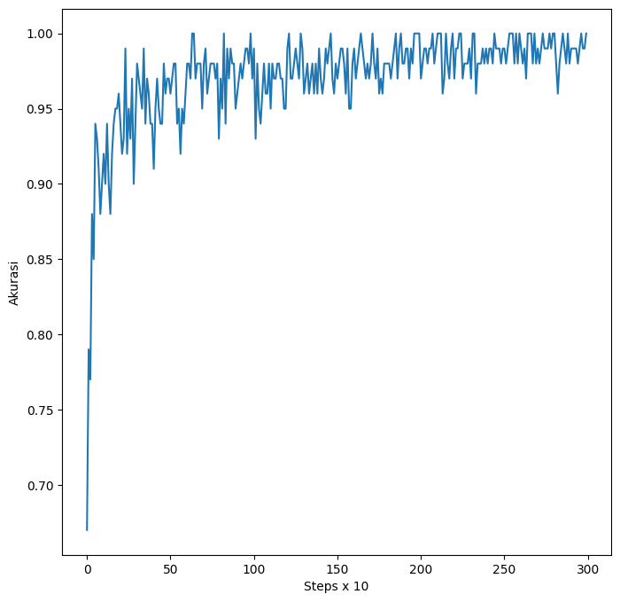

<table border style="width: 100%">
	<tr>
		<td><b>Nama</b></td>
		<td>Hugo Alfedo Putra</td>
		<td><b>NIM</b></td>
		<td>225150201111013</td>
	</tr>
	<tr>
		<td><b>Kelas</b></td>
		<td>DL-B</td>
		<td><b>Tanggal Tugas</b></td>
		<td>3 September 2024</td>
	</tr>
	<tr>
		<td colspan=2><b>Judul Tugas</b></td>
		<td colspan=2>Backpropagation Menggunakan PyTorch</td>
	</tr>
</table>

<br>

Laporan ini ditulis sesuai dengan urutan kemunculan cuplikan-cuplikan kode pada [contoh feed-forward neural-network PyTorch oleh junjey](https://github.com/yunjey/pytorch-tutorial/blob/master/tutorials/01-basics/feedforward_neural_network/main.py). Kode yang telah dimodifikasi dapat diakses melalui [link Google Colab ini](https://colab.research.google.com/drive/1LkkwxfMdWn76Rrd2Kn8qd2nkNk4X92r0?usp=sharing) atau melalui [Github](https://github.com/hugoalfedoputra-ub/ml/blob/main/nn_course/T1/Tugas_1_PyTorch_Backprop.ipynb).

# Arsitektur Jaringan

```py
# Fully connected neural network with one hidden layer
class NeuralNet(nn.Module):
    def __init__(self, input_size, hidden_size, num_classes):
        super(NeuralNet, self).__init__()
        ...

    def forward(self, x):
        ...

model = NeuralNet(input_size, hidden_size, num_classes).to(device)
```

Pertama, `class NeuralNet(nn.Module)` merupakan deklarasi kelas `NeuralNet` yang meng-extend kelas nn.Module milik PyTorch, sebagaimana pula direkomendasikan dalam [dokumentasi PyTorch sendiri](https://pytorch.org/tutorials/recipes/recipes/defining_a_neural_network.html).

```py
self.fc1 = nn.Linear(input_size, hidden_size)
self.relu = nn.ReLU()
self.fc2 = nn.Linear(hidden_size, num_classes)
```

merupakan arsitektur jaringan `NeuralNet` yang terdiri dari dua lapisan berupa Fully Connected (FC) layer yang mengapit fungsi aktivasi ReLU (Rectified Linear Unit). FC layer sendiri berarti tiap neuron input memetakan ke tiap output neuron (M:N).

Gambar arsitektur jaringan seperti berikut:


## Implementasi Fungsi Aktivasi Lain

Digunakan fungsi aktivasi lain berupa:

-   Untuk hidden layer: (1) Sigmoid dan (2) LeakyReLU untuk menghindari permasalahan pada ReLU di mana saat weighted sum $\leq$ 0 akan menyebabkan neuron itu mati atau hanya bernilai 0.
-   Untuk output layer: Softmax untuk menghasilkan distribusi probabilitas sebagai input Cross Entropy Loss.

<br>

# Hasil Eksperimen

## Hasil RandomizedSearch

Dari hasil RandomizedSearch dipilih tiga parameter-parameter terbaik, dirincikan:

<table border>
    <tr>
        <td colspan=3><b>Nama Model</b></td>
    </tr>
    <tr>
        <td><b><code>Rank_1</code></b></td>
        <td><b><code>Rank_2</code></b></td>
        <td><b><code>Rank_3</code></b></td>
    </tr>
    <tr>
        <td>
            <code>
                'batch_size': 600, <br>
                'lr': 0.01, <br>
                'max_epochs': 3, <br>
                'activation': LeakyReLU', <br>
                'hidden_layers': 2, <br>
                'hidden_size': 400
            </code>
        </td>
        <td>
            <code>
                'batch_size': 600, <br>
                'lr': 0.01, <br>
                'max_epochs': 7, <br>
                'activation': ReLU', <br>
                'hidden_layers': 1, <br>
                'hidden_size': 600
            </code>
        </td>
        <td>
            <code>
                'batch_size': 100, <br>
                'lr': 0.001, <br>
                'max_epochs': 3, <br>
                'activation': LeakyReLU', <br>
                'hidden_layers': 2, <br>
                'hidden_size': 400
            </code>
        </td>
    </tr>
</table>

## Visualisasi Loss

Berikut adalah visualisasi loss dengan hyper-parameter sesuai dengan [contoh oleh junjey](https://github.com/yunjey/pytorch-tutorial/blob/master/tutorials/01-basics/feedforward_neural_network/main.py) atau model `yunjey`:


Terlihat bahwa semakin banyak step yang dilakukan, nilai loss mengecil kemudian melandai.

Berikut adalah visualisasi loss pada model `Rank_1`, `Rank_2`, dan `Rank_3`:


## Akurasi

Berikut adalah visualisasi akurasi pada model `yunjey` di sisi kiri dan akurasi pada model `Rank_1`, `Rank_2`, dan `Rank_3` di sisi kanan:

<div style="grid-column: 1/2">
    
    
</div>

<br>
Berikut adalah tabel akurasi untuk model `Rank_1`, `Rank_2`, dan `Rank_3`:

<table border>
    <tr>
        <td colspan=4><b>Akurasi Model</b></td>
    </tr>
    <tr>
        <td><b><code>yunjey</code></b></td>
        <td><b><code>Rank_1</code></b></td>
        <td><b><code>Rank_2</code></b></td>
        <td><b><code>Rank_3</code></b></td>
    </tr>
    <tr>
        <td>97.86%</td>
        <td>69.75%</td>
        <td>96.59%</td>
        <td>86.14%</td>
    </tr>
</table>

## Eksperimen Lanjut

Dari visualisasi akurasi, terlihat model `Rank_2` memiliki peningkatan akurasi yang signifikan; berbeda halnya dengan `Rank_3` di mana akurasinya sudah relatif melandai di mana loss-nya pun juga melandai. Hasil tersebut tidak terlihat memiliki potensi karena nilai loss yang sudah melandai dahulu belum tentu akan meningkatkan akurasi (karena dari saat itu model hanya akan belajar terlalu sedikit demi sedikit).

Hasil model `Rank_2`&mdash;yang memiliki konvergensi (dalam kasus ini melandainya loss) yang lebih cepat dibanding `Rank_1`&mdash;memotivasi eksperimen lebih lanjut yaitu dengan meningkatkan `max_epoch` menjadi 5. Pada `Rank_2` pula akan diimplementasikan fungsi aktivasi sigmoid. Terlihat pula `learning_rate` pada `Rank_1` dan `Rank_2` sama, sehingga konvergensi `Rank_1` yang relatif lamban dapat disebabkan oleh tambahan satu hidden layer.

Perlu diketahui model `Rank_1`, `Rank_2`, dan `Rank_3` menggunakan softmax pada neuron output. Hal tersebut memotivasi eksperimen pada model `Rank_2` dengan menerapkan fungsi aktivasi leakyReLU dan sigmoid baik menggunakan softmax maupun tidak.

<table border>
    <tr>
        <td colspan=3><b>Model-model modifikasi <code>Rank_2</code></b></td>
        <td colspan=2><b>Model-model modifikasi <code>Rank_2</code> tanpa softmax</b></td>
    </tr>
    <tr>
        <td><b><code>Rank_2_</code></b></td>
        <td><b><code>Rank_2_v2</code></b></td>
        <td><b><code>Rank_2_Sigmoid</code></b></td>
        <td><b><code>Rank_2_v2_nsm</code></b></td>
        <td><b><code>Rank_2_Sigmoid_nsm</code></b></td>
    </tr>
    <tr>
        <td>
            <code>
                'batch_size': 600, <br>
                'lr': 0.01, <br>
                'max_epochs': 7, <br>
                'activation': ReLU', <br>
                'hidden_layers': 1, <br>
                'hidden_size': 600
            </code>
        </td>
        <td>
            <code>
                'batch_size': 600, <br>
                'lr': 0.01, <br>
                'max_epochs': 7, <br>
                'activation': LeakyReLU', <br>
                'hidden_layers': 1, <br>
                'hidden_size': 600
            </code>
        </td>
        <td>
            <code>
                'batch_size': 600, <br>
                'lr': 0.01, <br>
                'max_epochs': 7, <br>
                'activation': Sigmoid', <br>
                'hidden_layers': 1, <br>
                'hidden_size': 600
            </code>
        </td>
        <td>
            <code>
                'batch_size': 600, <br>
                'lr': 0.01, <br>
                'max_epochs': 7, <br>
                'activation': LeakyReLU', <br>
                'hidden_layers': 1, <br>
                'hidden_size': 600
            </code>
        </td>
        <td>
            <code>
                'batch_size': 600, <br>
                'lr': 0.01, <br>
                'max_epochs': 7, <br>
                'activation': Sigmoid', <br>
                'hidden_layers': 1, <br>
                'hidden_size': 600
            </code>
        </td>
    </tr>
</table>

### Hasil Eksperimen Lanjut

Berikut adalah visualisasi dan tabel akurasi pada model `yunjey`, `Rank_2`, `Rank_2_v2`, `Rank_2_Sigmoid`, `Rank_2_v2_nsm`, dan `Rank_2_Sigmoid_nsm`:

<div style="grid-column: 1/2">
    
    
<div>

<br>

<table border>
    <tr>
        <td colspan=6><b>Akurasi Model</b></td>
    </tr>
    <tr>
        <td><b><code>yunjey</code></b></td>
        <td><b><code>Rank_2</code></b></td>
        <td><b><code>Rank_2_v2</code></b></td>
        <td><b><code>Rank_2_Sigmoid</code></b></td>
        <td><b><code>Rank_2_v2_nsm</code></b></td>
        <td><b><code>Rank_2_v2_sigmoid</code></b></td>
    </tr>
    <tr>
        <td>97.86%</td>
        <td>87.11%</td>
        <td>96.32%</td>
        <td>87.73%</td>
        <td>96.95%</td>
        <td>97.33%</td>
    </tr>
</table>

Dari hasil-hasil tersebut, terlihat bahwa fungsi aktivasi sigmoid lebih cepat konvergen (loss melandai lebih cepat) dibanding dengan ReLU dan LeakyReLU. Terlihat pula loss melandai relatif cukup lamban apabila tidak menggunakan softmax. Namun, penggunaan LeakyReLU pada `Rank_2_v2` menghasilkan akurasi yang lebih landai atau konsisten dibandingkan dengan sigmoid.

Fluktuasi dalam akurasi pada `Rank_2_Sigmoid` dapat disebabkan oleh vanishing gradient problem (VGP) di mana nilai-nilai gradien yang dihasilkan mendekati nol (sangat kecil seakan-akan menghilang). Namun, fluktuasi tersebut hilang atau distabilkan dengan tidak menggunakan softmax seperti pada `Rank_2_Sigmoid_nsm`. Hal tersebut menunjukkan penggunaan softmax pula dapat memperparah VGP karena sejatinya softmax akan bergradien kecil saat nilai $x$ besar (arah positif dan negatif).

## Konvergensi Model

Konvergensi model dapat berupa melandainya loss:

1. Pada [contoh oleh junjey](https://github.com/yunjey/pytorch-tutorial/blob/master/tutorials/01-basics/feedforward_neural_network/main.py) tampak setelah 2000 step.
2. Pada `Rank_1` terlihat loss menurun cukup lamban dan akhirnya konvergen menjelang step-step terakhir
3. Pada `Rank_2` terlihat loss menurun tajam dan relatif melandai di paling akhir
4. Pada `Rank_3` terlihat loss menurun tajam sama halnya dengan `Rank_2` lalu melandai saat `num_epoch` tercapai
5. Pada `Rank_2_v2` mirip dengan `Rank_2`
6. Pada `Rank_2_Sigmoid` terlihat loss menurun tajam dan bahkan lebih cepat daripada `Rank_2` dan `Rank_2_v2`
7. Pada `Rank_2_v2_nsm` loss menurun cukup lamban; tetapi masih lebih lamban daripada `Rank_1`
8. Pada `Rank_2_Sigmoid_nsm` loss menurun relatif lebih cepat dibanding dengan `Rank_2_v2_nsm`; tetapi masih lebih lamban daripada `Rank_1`

# Kesimpulan

Neural network menerapkan forward pass, backward pass, dan optimasi untuk memperbarui nilai-nilai bobot dan bias. Pada dataset MNIST, sebuah neural network memprediksi digit dari gambar. Hasil-hasil latihan memperlihatkan bahwa parameter pada model `yunjey` memberikan hasil yang lebih akurat dibanding model-model eksperimen lainnya. Parameter-parameter yang berbeda pula tentu memberikan pengaruh terhadap konvergensi dan akurasi model. Terdapat parameter yang memberikan konvergensi yang relatif lamban seperti pada `Rank_1` dan juga relatif cepat seperti pada `Rank_2`, `Rank_2_Sigmoid`, `Rank_3`, dan juga `yunjey`. Selain itu, penggunaan fungsi aktivasi juga memainkan peran penting dalam kecepatan konvergensi dan kapan model dapat memprediksi hasil-hasil yang akurat.
